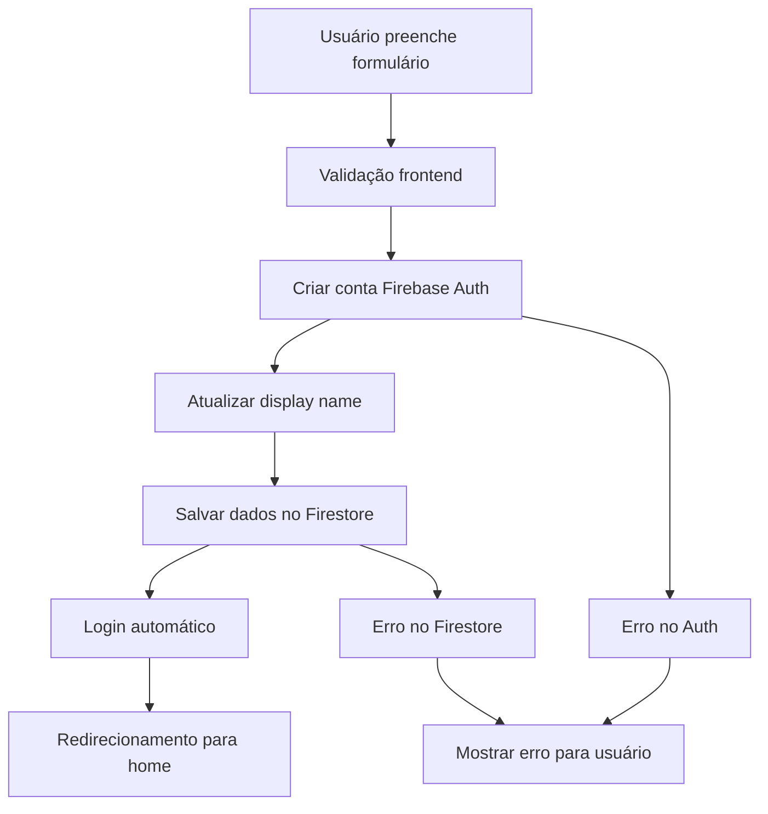

# Guia de Registro de Usuários no Firestore

Este documento explica como funciona o sistema de registro de usuários e como verificar se os dados estão sendo salvos corretamente no Firestore Database.

## 🔧 Como Funciona o Registro

### 1. **Processo de Registro**
1. Usuário preenche formulário de registro (`/registro`)
2. Sistema cria conta no Firebase Auth
3. Sistema salva dados adicionais no Firestore
4. Usuário é automaticamente logado

### 2. **Dados Salvos no Firestore**
```typescript
{
  id: string,              // UID do Firebase Auth
  name: string,            // Nome fornecido pelo usuário
  email: string,           // Email de registro
  avatar: string,          // Avatar gerado automaticamente
  role: 'user',           // Role padrão
  createdAt: string,      // Data de criação
  updatedAt: string       // Última atualização
}
```

## 🚀 Como Testar o Registro

### 1. **Registrar um Novo Usuário**
1. Acesse `/registro` na aplicação
2. Preencha o formulário:
   - Nome completo
   - Email válido
   - Senha (mínimo 6 caracteres)
   - Confirmação de senha
3. Clique em "Criar conta"

### 2. **Verificar no Console do Navegador**
Abra o DevTools (F12) e procure por estas mensagens:

```
🔄 Iniciando registro de usuário...
✅ Usuário criado no Firebase Auth: [UID]
✅ Display name atualizado
✅ Usuário salvo no Firestore: { uid: '...', name: '...', email: '...', role: 'user' }
```

### 3. **Verificar no Firebase Console**
1. Acesse [Firebase Console](https://console.firebase.google.com)
2. Selecione seu projeto
3. Vá para **Authentication** → **Users**
4. Verifique se o usuário aparece na lista
5. Vá para **Firestore Database**
6. Navegue para a coleção `users`
7. Verifique se existe um documento com o UID do usuário

## 🔍 Verificando Usuários Registrados

### **Painel Administrativo**
1. Faça login como administrador
2. Acesse `/admin`
3. Clique em "Usuários"
4. Veja a lista completa de usuários registrados

### **Via Console JavaScript**
No console do navegador, execute:

```javascript
// Importar funções (só funciona se estiver na aplicação)
import { getAllUsers } from './src/utils/userManagement';

// Buscar todos os usuários
getAllUsers().then(users => {
    console.log('Usuários registrados:', users);
});
```

## 📊 Gerenciamento de Usuários

### **Promover Usuário a Admin**

#### Opção 1: Via Painel Admin
1. Acesse `/admin/usuarios`
2. Encontre o usuário na lista
3. Clique em "Promover a Admin"

#### Opção 2: Via Script
```bash
# Configure o arquivo create-admin.js com o UID do usuário
node create-admin.js
```

#### Opção 3: Via Firebase Console
1. Acesse Firestore Database
2. Navegue para `users/[UID]`
3. Edite o campo `role` para `'admin'`

### **Estatísticas de Usuários**
O painel admin mostra:
- Total de usuários registrados
- Número de administradores
- Número de usuários regulares

## 🛠️ Solução de Problemas

### **Usuário não aparece no Firestore**

#### Possíveis causas:
1. **Regras do Firestore**: Verifique se as regras permitem escrita
2. **Conexão**: Problemas de internet durante o registro
3. **Permissões**: Configuração incorreta do Firebase

#### Soluções:
```bash
# 1. Verificar regras do Firestore
npm run setup:firestore

# 2. Verificar no console se há erros
# Procure por mensagens de erro no DevTools

# 3. Testar conexão
# No console do navegador:
firebase.auth().currentUser
```

### **Erro "Permission denied"**

#### Verificar regras do Firestore:
```javascript
// firestore.rules
rules_version = '2';
service cloud.firestore {
  match /databases/{database}/documents {
    match /users/{userId} {
      allow read, write: if request.auth != null && request.auth.uid == userId;
    }
  }
}
```

### **Usuário criado no Auth mas não no Firestore**

#### Isso pode acontecer se:
1. Há erro nas regras do Firestore
2. Conexão interrompida durante o processo
3. Cota do Firestore excedida

#### Para corrigir:
```javascript
// Recriar dados do usuário no Firestore
const user = firebase.auth().currentUser;
if (user) {
    const userData = {
        name: user.displayName || 'Usuário',
        email: user.email,
        avatar: `https://api.dicebear.com/7.x/avataaars/svg?seed=${user.email}`,
        role: 'user',
        createdAt: new Date().toISOString(),
        updatedAt: new Date().toISOString()
    };
    
    firebase.firestore().collection('users').doc(user.uid).set(userData);
}
```

## 📋 Checklist de Verificação

- [ ] Firebase Auth configurado
- [ ] Firestore configurado
- [ ] Regras do Firestore aplicadas
- [ ] Formulário de registro funcionando
- [ ] Console mostra logs de sucesso
- [ ] Usuário aparece no Firebase Auth
- [ ] Usuário aparece no Firestore
- [ ] Painel admin mostra usuários
- [ ] Promover a admin funciona

## 🔄 Fluxo Completo do Registro



## 🎯 Comandos Úteis

```bash
# Executar aplicação
npm run dev

# Verificar usuário específico (após configurar script)
npm run setup:admin

# Deploy das regras do Firestore
npm run setup:firestore

# Ver logs em tempo real
# No console do navegador, os logs aparecem automaticamente
```

## ✅ Status Atual

O sistema de registro está **totalmente funcional** e:

- ✅ Salva usuários no Firestore automaticamente
- ✅ Inclui logs detalhados para debug
- ✅ Tem sistema de fallback em caso de erro
- ✅ Interface de administração completa
- ✅ Gerenciamento de roles implementado

**🎉 Todos os usuários que se registrarem serão automaticamente salvos no Firestore Database!** 